# DevOps CI/CD Pipeline with Nginx Reverse Proxy (Port 80)

## Project Overview

This project demonstrates an end-to-end CI/CD pipeline that deploys a containerized Flask application using Docker and serves it via Nginx on port 80.

## Architecture Overview

This project demonstrates a complete CI/CD pipeline using:

- GitHub Actions for automation
- Docker for containerization
- AWS EC2 for compute
- Nginx as a reverse proxy (port 80 → 5000)

---

## Workflow

1. Developer pushes code to GitHub  
2. GitHub Actions pipeline is triggered  
3. Docker image is built  
4. Container runs on EC2 (port 5000)  
5. Nginx routes traffic from port 80 → 5000  

---

## Technologies Used

- Python (Flask)
- Docker
- Nginx
- AWS EC2
- GitHub Actions

---

## Deployment Walkthrough

### 1. Project Initialization
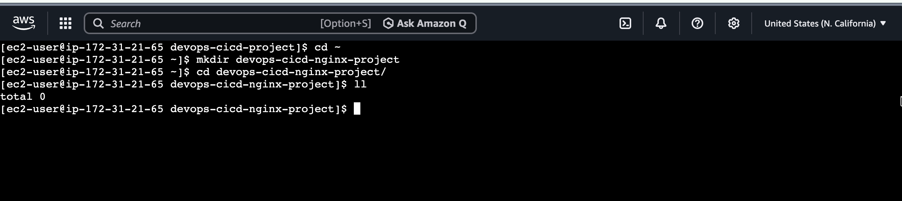

### 2. Project Scaffolding
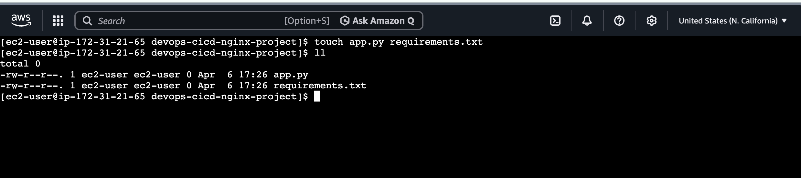

### 3. Application Code
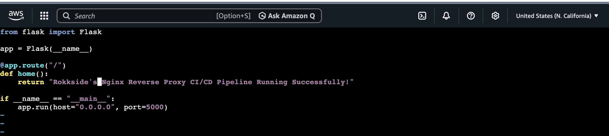

### 4. Dependencies Installation
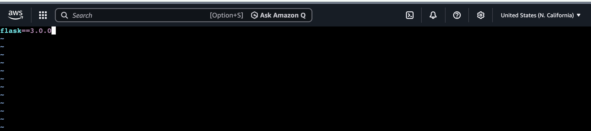

---

## Docker & Containerization

### 5. Flask App Running (Port 5000)
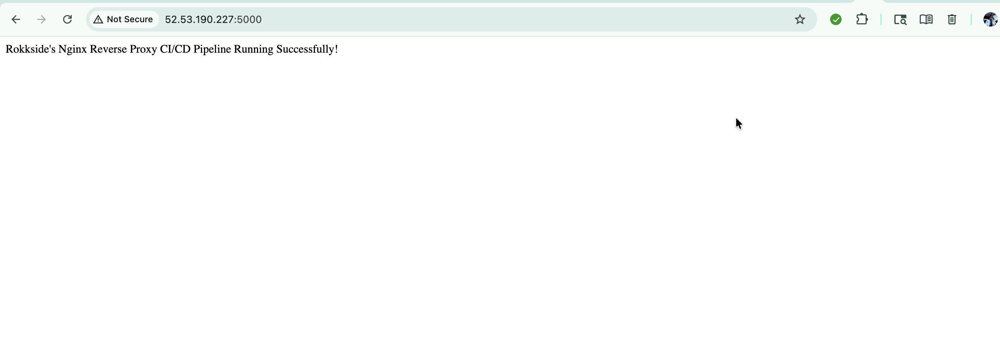

### 6. Flask Logs Verification
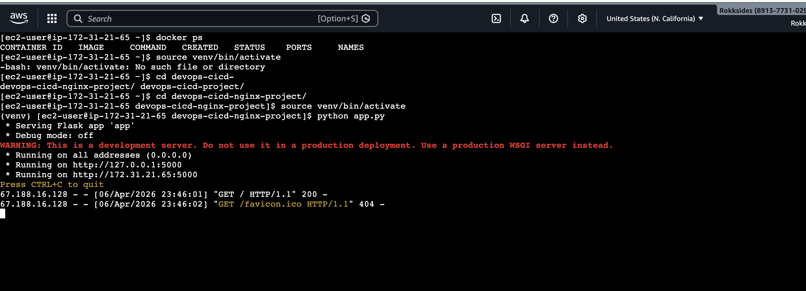

### 7. Dockerfile Setup
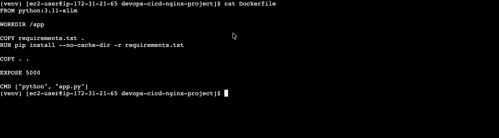

### 8. Docker Image Build
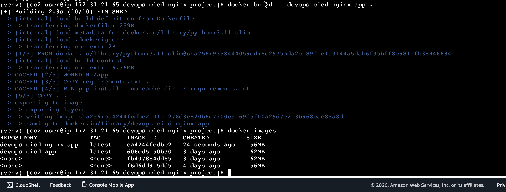

### 9. Container Running (Pre-Nginx)
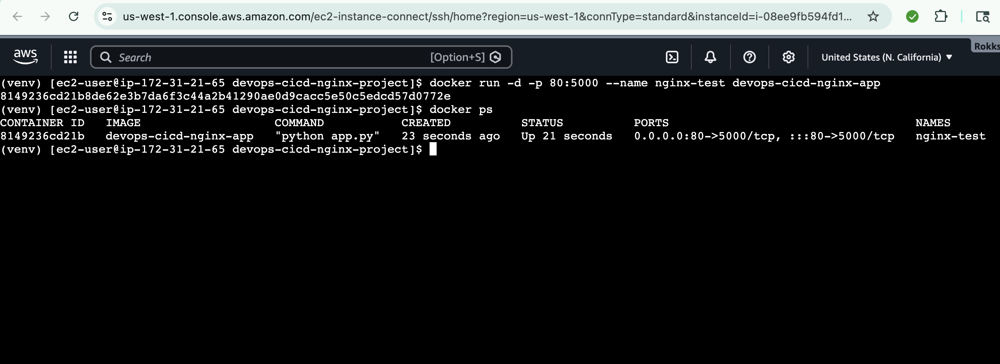

---

## Nginx Reverse Proxy Setup

### 10. Nginx Started (Port Conflict Resolved)
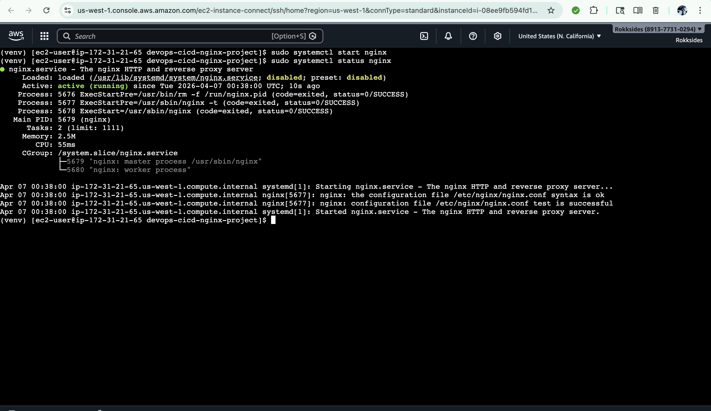

### 11. Nginx Running on Port 80
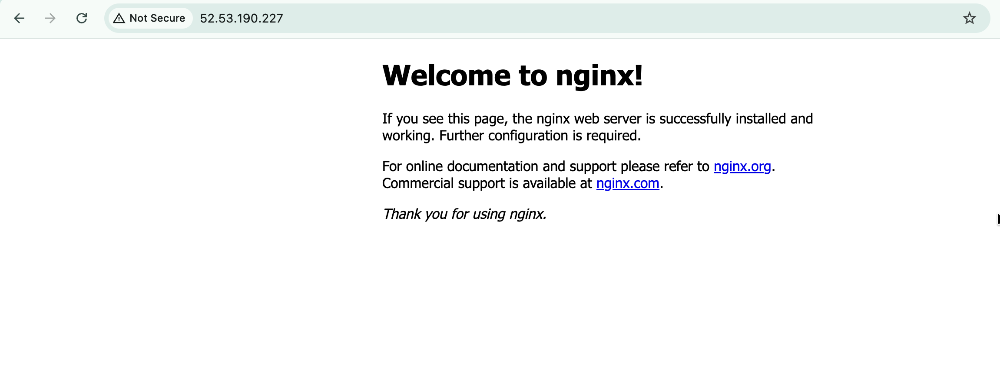

### 12. Flask Backend Behind Nginx (Port 5000)
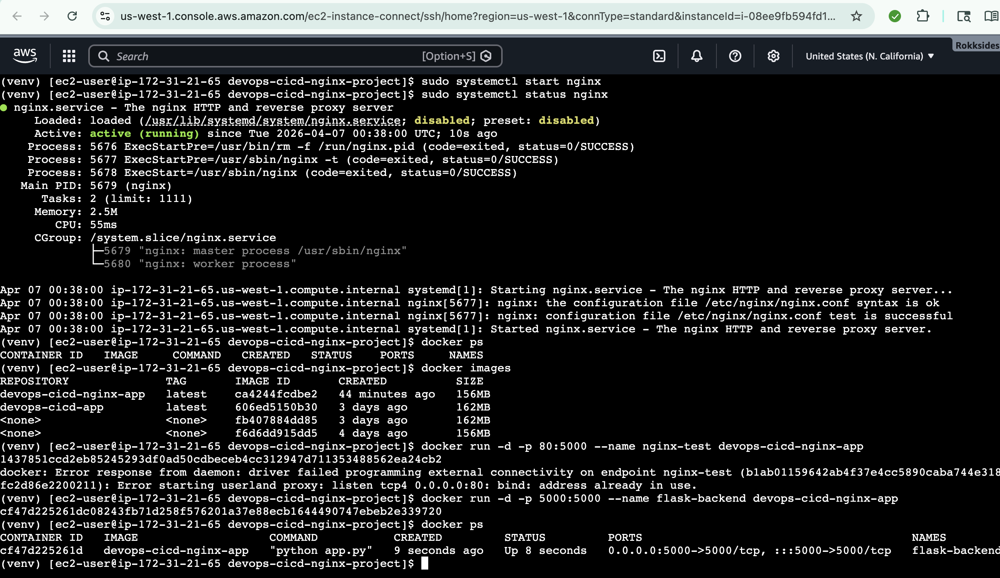

### 13. Nginx Reverse Proxy Configuration
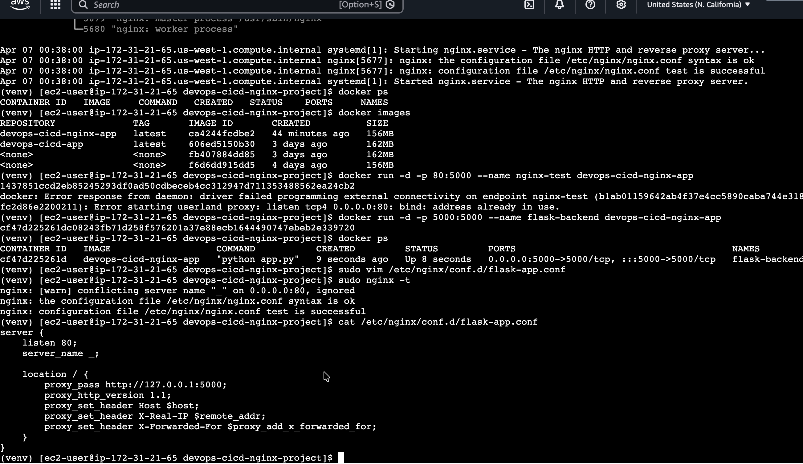

### 14. Application Served via Nginx (Port 80)
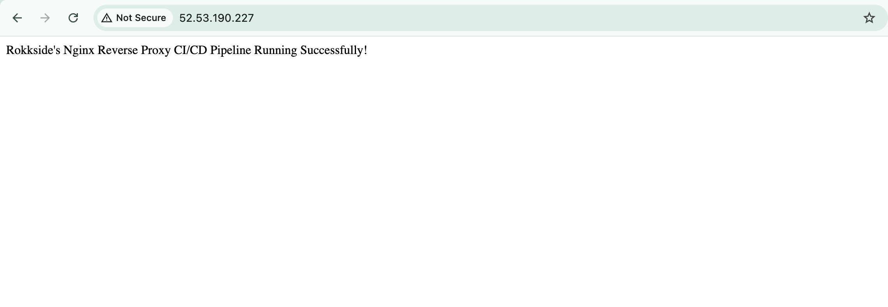

### 15. Port Validation (80 → 5000)
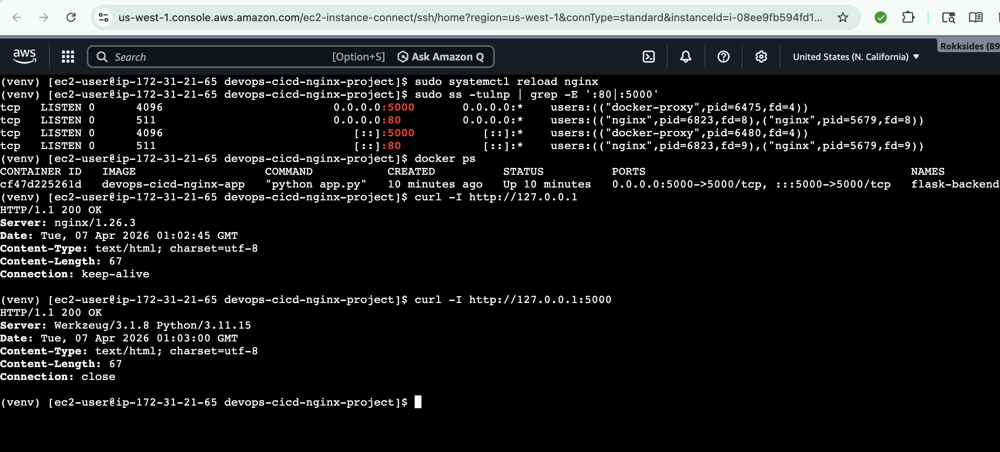

---

## CI/CD Pipeline (GitHub Actions)

### 16. GitHub Repository Setup
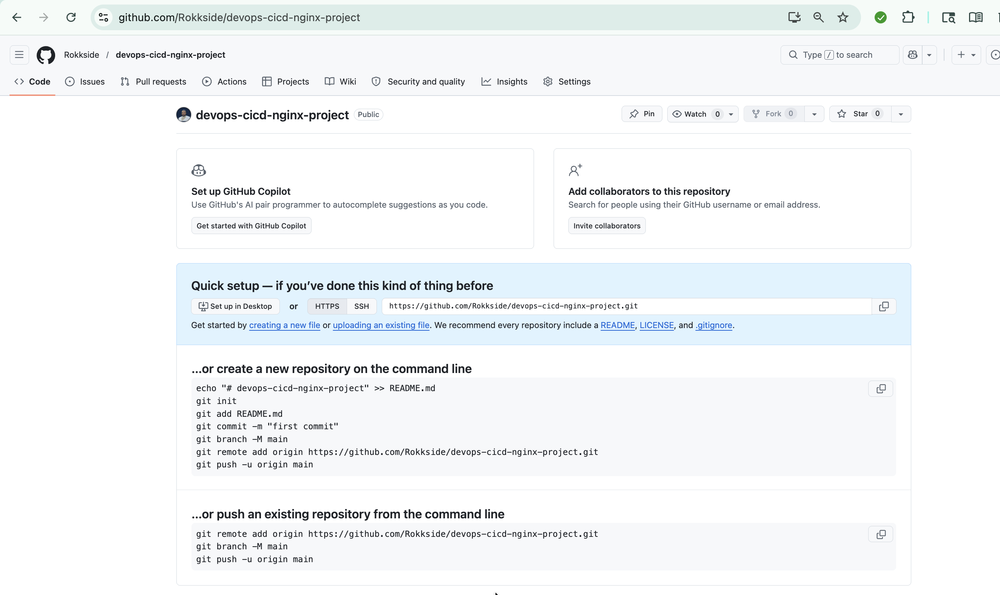

### 17. Repository Cleanup (.gitignore)
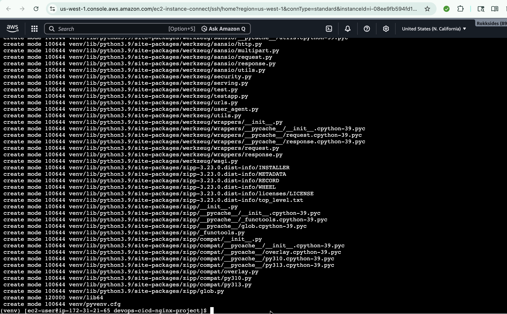

### 18. Project Documentation
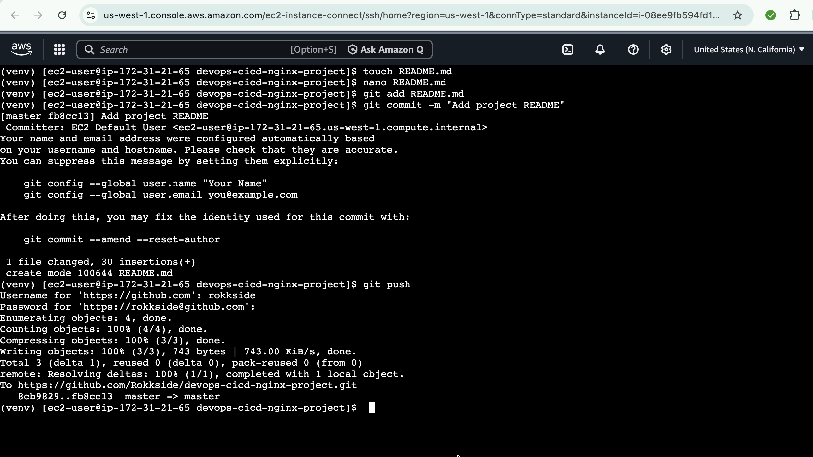

### 19. GitHub Actions Workflow
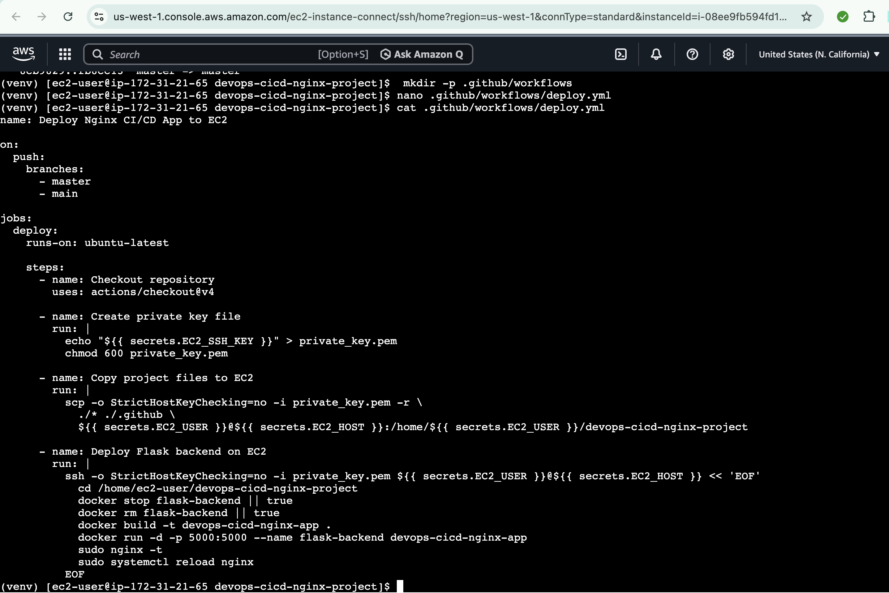

### 20. Pipeline Execution Success
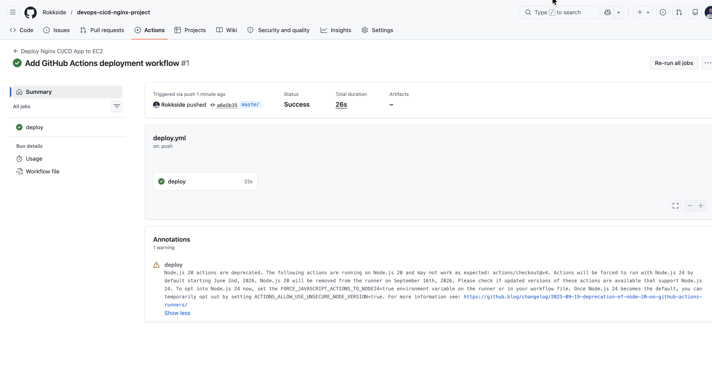

---

## Outcome

- Production-style reverse proxy architecture  
- Automated CI/CD deployment pipeline  
- Publicly accessible application via port 80  
- Clean DevOps workflow from code → deployment  

---

## Next Steps

- Terraform infrastructure automation  
- HTTPS (SSL via Nginx + Certbot)  
- Load balancing & scaling  
